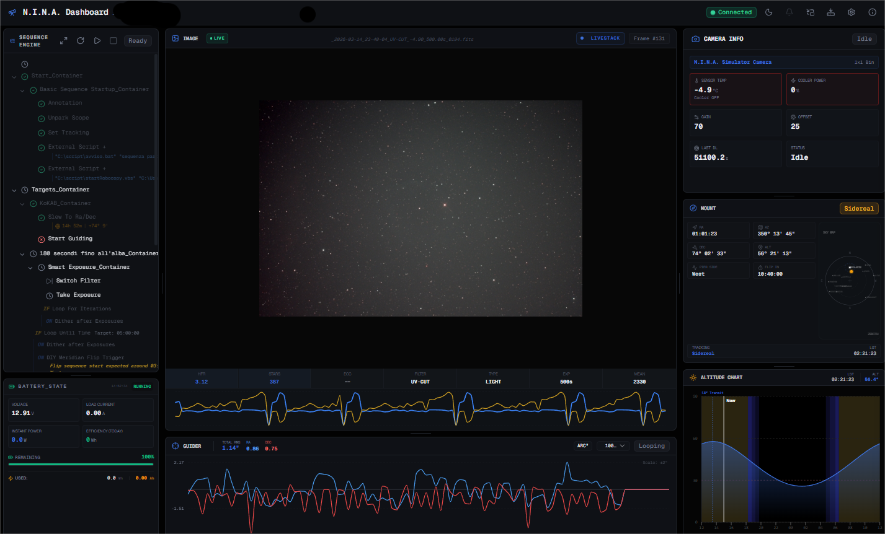

# NINA Dashboard v0

A modern, fast, and beautiful web dashboard for [N.I.N.A. (Nighttime Imaging 'N' Astronomy)](https://nighttime-imaging.eu/). Monitor your astrophotography sessions in real-time from any device in your network.



## 🚀 Key Features

- **Real-time Monitoring**: Connects directly to the NINA API to show live status.
- **Advanced Sequence Panel**: Powered by the `/v2/api/sequence/state` endpoint for verbose details:
  - **External Scripts**: View full command lines and processed script paths.
  - **Meridian Flip Status**: Real-time tracking of flip windows and transit times.
  - **Loop Conditions**: Detailed feedback for "Loop Until Time" (target time) and "Loop until Altitude" (degree offsets).
  - **Guiding Integration**: Monitor "Slew to RA/DEC" with formatted coordinates and RMS trigger thresholds.
  - **Equipment Status**: Critical info like Camera Cooling targets and device reconnection status.
- **Dual View**:
  - **Compact View**: Optimized for sidebars and small screens.
  - **Sequence Inspector**: A full-screen, deep-dive view into every instruction, trigger, and condition.
- **Cross-Platform**: Works on desktop, tablets, and mobile browsers.

## 🛠️ Tech Stack

- **Framework**: [Next.js 15](https://nextjs.org/) (App Router)
- **Styling**: [Tailwind CSS](https://tailwindcss.com/)
- **UI Components**: [Shadcn UI](https://ui.shadcn.com/) & [Radix Primitives](https://www.radix-ui.com/)
- **Icons**: [Lucide React](https://lucide.dev/)
- **State Management**: React Context & Hooks

## 📥 Installation

1. **Clone the repository**:
   ```bash
   git clone https://github.com/fab-far/NINA_v0.git
   cd NINA_v0
   ```

2. **Install dependencies**:
   ```bash
   npm install
   ```

3. **Run the development server**:
   ```bash
   npm run dev
   ```
   Open [http://localhost:3000/dash](http://localhost:3000/dash) (or the port shown in your terminal).

## 🌐 Deployment

### Local Build (Home Network)
To build a static version for your local NINA setup:
```bash
npm run build
```
The output will be in the `out` directory, with a default `basePath` of `/dash`.

### Vercel Deployment
The project is optimized for [Vercel](https://vercel.com). It automatically detects the Vercel environment to adjust the `basePath` and ensure a smooth "black-screen-free" deployment.

## 🔗 NINA Integration

This dashboard requires the NINA Web API to be enabled.
- Ensure NINA is running.
- Port: Default `1888`.
- In the dashboard, enter your NINA host IP (e.g., `192.168.1.50` or `ace-magician-astro-pc.local`).

## 📄 License

This project is private/custom for personal astrophotography use.
