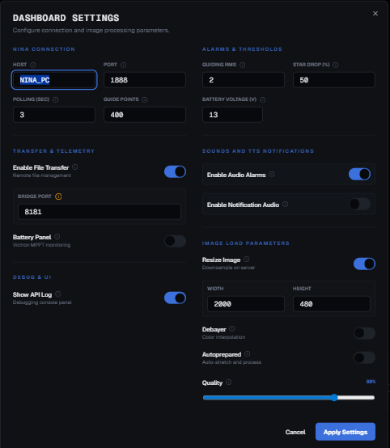

# NINA Dashboard v0

A modern, fast, and beautiful web dashboard for [N.I.N.A. (Nighttime Imaging 'N' Astronomy)](https://nighttime-imaging.eu/). Monitor your astrophotography sessions in real-time from any device in your network.


## 🚀 Key Features

This dashboard provides a comprehensive view of your entire astrophotography setup, pulling data directly from N.I.N.A.'s Advanced API:

- **📸 Image History & LiveStack**: Track your session's progress. View the latest images, image history statistics (HFR, Stars, Eccentricity), and monitor LiveStack previews directly in the browser.
- **🔭 Mount Control & Sky Map**: Real-time tracking of RA/DEC, Altitude/Azimuth, Pier Side, and Time to Meridian Flip. Includes a live Sky Map and an Altitude chart showing your target's trajectory.
- **🎯 Autoguiding Integration**: Monitor your guiding performance with real-time RMS error readouts and a live guide graph. Adjustable scale and historical point tracking.
- **⚙️ Sequence Inspector**: Deep-dive into your running sequence. See active targets, exposure progress, loop conditions, autofocus triggers, and external script execution. You can also Play, Stop, and Reset sequences directly from the dashboard.
- **🔔 Intelligent Alarm System**: Configurable audio and visual alerts for critical events: Cooling failures, Guiding loss/high RMS, Star count drops, and Low battery voltage.
- **🔋 Battery & Telemetry**: (Requires custom `NINATransfer` Python plugin) Monitor your rig's power consumption, voltage, and remaining capacity in real-time.
- **📂 File Browser & Transfer**: Browse and download FITS/JPG files directly from the NINA PC to your remote device via the web interface.
- **📱 Responsive Design**: A unified, responsive layout that seamlessly adapts from ultrawide desktop monitors to mobile phones. Includes a flexible Picture-in-Picture (PiP) mode.

## 🛠️ Tech Stack

- **Framework**: [Next.js 15](https://nextjs.org/) (App Router)
- **Styling**: [Tailwind CSS](https://tailwindcss.com/)
- **UI Components**: [Shadcn UI](https://ui.shadcn.com/) & [Radix Primitives](https://www.radix-ui.com/)
- **Icons**: [Lucide React](https://lucide.dev/)
- **Charts**: [Recharts](https://recharts.org/)

## 📥 Installation & Usage

You have 3 main ways to run the NINA Dashboard: locally on your PC (for development/testing), or as a static build served directly from the NINA PC (recommended).

### Option A: Running via Node.js (Development)

Ensure you have [Node.js](https://nodejs.org/) installed.

1. **Clone the repository**:
   ```bash
   git clone https://github.com/fab-far/NINA_v0.git
   cd NINA_v0
   ```
2. **Install dependencies**:
   ```bash
   npm install
   ```
3. **Run the development server**:
   ```bash
   npm run dev
   ```
   Open `http://localhost:3000` in your browser.

### Option B: Static Build on the NINA PC (Recommended for Production)

For the most reliable experience and to avoid browser security restrictions (like Chrome's Private Network Access blocking), you can build the dashboard into static files and serve them directly from the mini-PC attached to your telescope using a lightweight web server.

1. **Build the project**:
   Run this command on your development machine (requires Node.js):
   ```bash
   npm run build
   ```
   This generates a static version of the dashboard inside the `out/` directory.

2. **Serve the `out/` folder on the NINA PC**:
   Copy the entire `out/` folder to your NINA PC. You can use any lightweight web server to host it. Here are two incredibly easy zero-configuration options:

   - **Using Python (Already installed on many systems)**:
     Open a command prompt inside the `out/` directory on your NINA PC and run:
     ```bash
     python -m http.server 8080
     ```
     *(If port 8080 is busy, choose another like 8085).*

   - **Using `http-server` (via Node.js)**:
     If you have Node.js on the NINA PC, open a command prompt and run:
     ```bash
     npx http-server ./out -p 8080
     ```

   You can now access the dashboard from any browser on your network by typing: `http://<IP-DEL-NINAPC>:8080`.

### Option C: Hosted via Vercel (Quick Access)

If you don't want to run or build the application yourself, you can use the hosted version of the dashboard directly from any browser:

1. Open [https://nina-v0.vercel.app/](https://nina-v0.vercel.app/)
2. Open the Settings panel (gear icon) and configure your NINA PC's local IP address and port:



*(Note: Depending on your browser, strict "Private Network Access" security blocks may prevent a public website like Vercel from talking to a local IP like `192.168.x.x`. If the data briefly appears and then fails with "Failed to fetch", use Option B or Option A instead).*

## 🔗 N.I.N.A. Configuration Requirements

This dashboard requires the **NINA Advanced API Plugin** to be installed and enabled in N.I.N.A.

1. Install the "Advanced API" plugin from the N.I.N.A. plugin manager.
2. In the N.I.N.A. plugin settings, ensure it is **ON** and running on the default port `1888`.
3. **CRITICAL**: Ensure **"Use Access-Control-Allow-Origin Header" (CORS)** is explicitly enabled in the plugin settings to allow external browsers to read the data.
4. In the Dashboard settings (gear icon), enter your NINA PC's IP address (e.g., `192.168.1.50`).

## 📄 License

This project is private/custom for personal astrophotography use.
